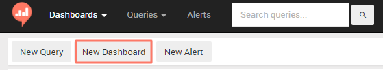
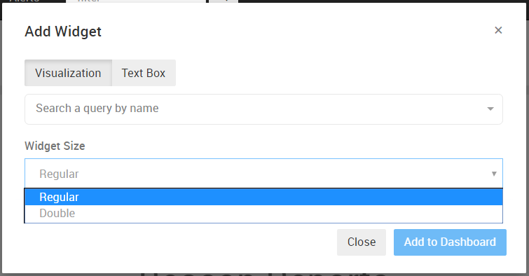
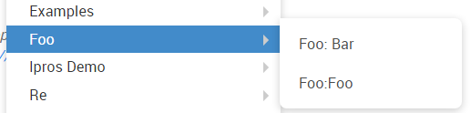

# Dashboards

##  How to create a dashboard?

A dashboard is a combination of visualizations and text boxes.

You can add a new dashboard via the Dashboard menu (bottom item will be New Dashabord) or via the home screen:

After naming your dashboard, you can start adding widgets to it from your existing query visualizations or create different commentary texts.

Select an existing query or add a text, you can select between 2 sizes - regular (half screen width) or double (full screen width).

##  Grouping Dashboards

It is possible to group multiple dashboards in the dashboards menu. To do this, you need to follow a naming convention by using a column (:) to separate the dashboard group and the actual dashboard name.

For example, if you name 2 dashboards "Foo: Bar" and "Foo: Baz", they will be grouped under the Foo namespace in the dropdown menu.

#  Sharing Dashboard (view only)

You can share existing dashboards with external users (they'll see only the widgets, without the navigation and other buttons from the Redash app).

To share a dashboard, toggle the share URL and send the secret link that gets generated:

#  Dashboard filters (flags)

If you’ve got queries that have some filters and you want to apply filters at the dashboard level (that apply to all queries), you need to set a flag.

You can do it through the admin interface at /admin/dashboard or manually by setting the column dashboard_filters_enabled of the table dashboards to TRUE in the Redash database.

If you are using the hosted service and wish to enable it for your dashboard/s - please contact us.
