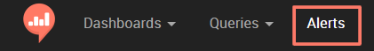
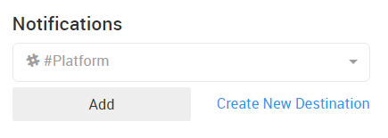

# How to Setup an Alert

In the Alerts view you'll see all existing alerts and an option to create a new one.

To setup a new alert:

1. Select the query you want to trigger an alert for (just start typing) - **queries with parameters won't work**

2. Select the column you want to watch

3. Select the trigger type (greater/less than or equals to)

4. Select your magic number

* Leave Rearm Seconds empty to get 1 alert when the status changes from Triggered to OK, enter a number to get an alert every time the query runs (by schedule) + the Rearm seconds value.

5. SAVE

6. Define alert destinations - email, [Slack](slack-alert-destination.md), HipChat and webhooks are supported.

