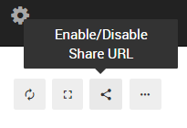

# Dashboards

* [How to Create a Dashboard?](#create_new_dash)
* [Adding Visualizations to Dashboards](#add_viz_to_dash)
* [Grouping Dashboards](#grouping_dashs)
* [How to Share Dashboard (view only)?](#sharing_dashs)
* [Embedding Dashboards](#embed_dash)
* [Dashboard Filters (flags)](#dash_filters_flags)

## How to Create a Dashboard? {#create_new_dash}

A dashboard is defined as a combination of visualizations and text boxes.
Read on for more detail.

You can add a new dashboard via the Dashboard menu (last item will be New Dashboard) or via the home screen:

After naming your dashboard, you can start adding widgets to it from existing query visualizations or create different commentary texts.

Select an existing query or add a text, you can select between 2 sizes - regular (half screen width) or double (full screen width).

## Adding Visualizations to Dashboards {#add_viz_to_dash}

Dashboards aggregate multiple query datasets, visualizations and texts into one handy view. To add widgets to a dashboard, select the query you want to feature and the relevant visualization. By default, query results are shown in a table.

At the moment it's not possible to create a new visualization from the "Add Widget" menu, so you'll need to open the query and add the visualization there beforehand ([instructions](../visualization/visualization.md#create_new_viz))

## Grouping Dashboards {#grouping_dashs}

It is possible to group multiple dashboards in the dashboards menu. To do this, simply follow the naming convention of using a colon (:) to separate the dashboard group and name.

e.g. Dashboards named "Foo: Bar" and "Foo: Baz" will both be shown in the Foo group in the dashboards menu.

## Sharing Dashboard (view only) {#sharing_dashs}

You can share existing dashboards with external users (they'll see only the widgets, without the navigation and other buttons from the Redash app).

To share a dashboard, toggle the share URL and send the secret link that gets generated:

## Embedding Dashboards {#embed_dash}
To embed a dashboard, add `?fullscreen` to the sharing URL.

## Dashboard Filters (flags) {#dash_filters_flags}

If your queries have filters and you want to apply filters at the dashboard level (that apply to all queries), you need to set a flag.

This can be done through the admin interface at /admin/dashboard or manually by setting the column dashboard_filters_enabled of the table dashboards to TRUE in the Redash database.

If you are using the hosted service and want to enable this for your dashboard - please contact us and send the URL of the dashboard you want to apply the filters for. Make sure to add filters to each query you want to filter in that dashboard.
