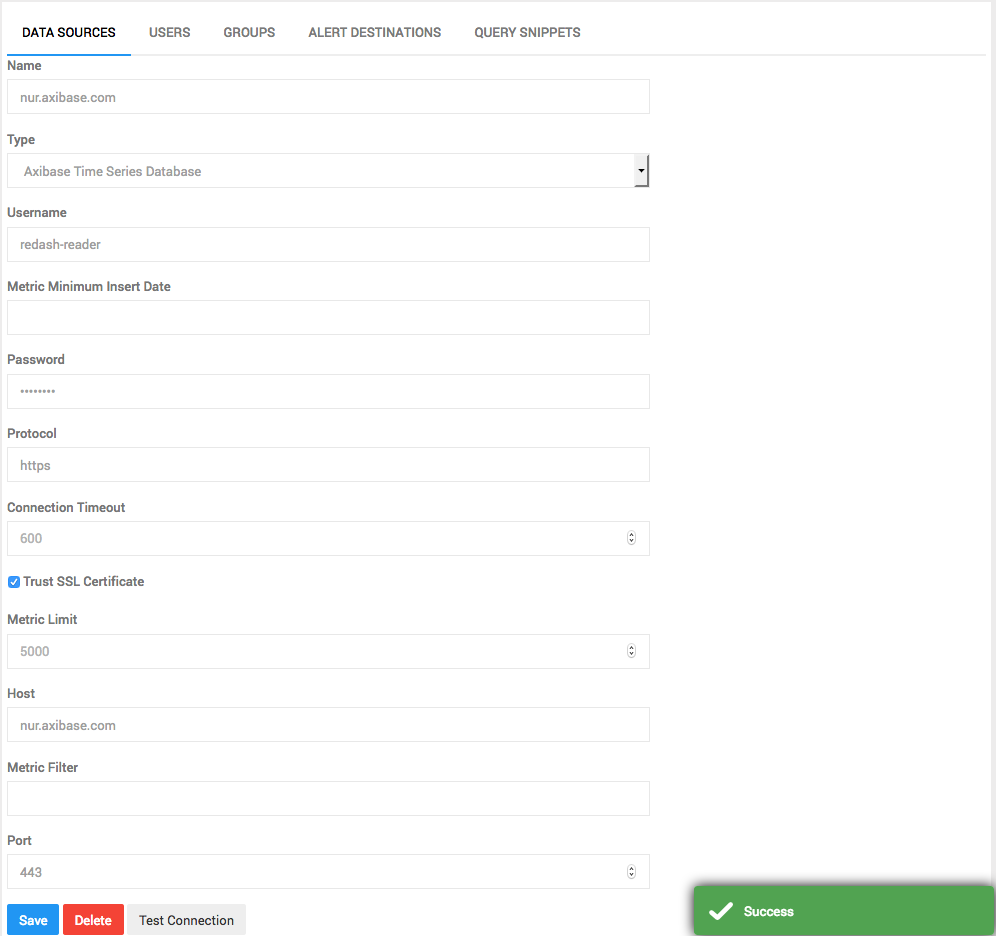

# Axibase Time Series Database Data Source

## User Setup

### Create User Group with READ-ONLY Permissions

1. Login into ATSD web interface at https://atsd_host:8443.
2. Open **Admin** > **User groups** page, click **Create**.
3. Specify user group name and optional description.
4. Grant the group 'Read' permission from 'All entities'. 
5. Press the **Save** button.

### Create User 

1. Open **Admin** > **Users** page, click **Create**.
2. Specify username, password, and other fields if necessary.
3. Add the user to the previously created User Group as a member in the 'Entity Permissions' section.
3. Press the **Save** button.

## Create Data Source

1. Login into Redash web interface.
2. Open the **New Data Source** page, select 'Axibase Time Series Database' as type.
3. Complete the following fields on the configuration form:

| **Name** | **Default Value** | **Required** | **Description** |
|:---|:---|:---|:---|
| `Username` | --- | Yes | User name. |
| `Password` | --- | Yes | User password. |
| `Metric Limit` | 5000 | No | Maximum number of ATSD [metrics](https://github.com/axibase/atsd-docs/blob/master/api/meta/metric/list.md#query-parameters) displayed as tables in Redash.|
| `Metric Filter` | --- | No | Include metrics that match an [expression filter](https://github.com/axibase/atsd-docs/blob/master/api/meta/metric/list.md#query-parameters). |
| `Metric Minimum Insert Date` | --- | No | Include metrics with [last insert date](https://github.com/axibase/atsd-docs/blob/master/api/meta/metric/list.md#query-parameters) equal to or greater than the specified date. ISO date format and endtime syntax is supported.|
| `Protocol` | http | Yes | Connection protocol. |
| `Trust SSL Certificate ` | False | No |  Trust SSL certificate, if the cerificate is self-signed. |
| `Host` | localhost | No | ATSD hostname or IP address.|
| `Port` | 8088 | No | ATSD http (8088) or https (8443) port.|
| `Connection Timeout` | 600 | No | Connection timeout in seconds. |

* Save the data source.
* Test the connection by pressing on the 'Test' button.

## Run a Query

Once the Test is successful, you can query the data stored in **Axibase Time Series Database**.

