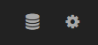

# How to add data sources to Redash?

To start using Redash, connect at least one data source.

**Important**: you need to allow access from the IP address 52.71.84.157 in your database firewall/security groups (unless it's publicly available).

You can add a new datasource from the quick link at the navigation bar:

Or via the Data Source tab in your admin settings:

We recommend using a user with read only permissions for the database.
