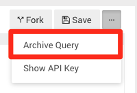

# Query Actions

* [How to Create a new query?](#how_to_create_a_query)
* [How to Duplicate Queries?](#how_to_duplicate_a_query)
* [How to Delete a Query?](#how-to-archive-query)
* [How to Schedule a Query?](#how_to_schedule_a_query)
* [How to Download the Results of My Query?](#how_to_download_a_dataset)
* [How to Export Query Results to CSV or Json?](#how_to_export_query_csv_json)
* [How to use Google Spreadsheets' IMPORTDATA function?](#google-spreadsheets-importdata)

## How to create a new query? {#how_to_create_a_query}

To start working on a new query, click "New Query" on the home page or under the Queries menu in the navigation bar.


## How to duplicate queries? {#how_to_duplicate_a_query}

When viewing a query's source code, click the "Fork" button to duplicate the query to your account and edit it once it's yours.
For now only admins can edit all queries.


Soon we'll add an option to share edit permissions and view changes history for each query.



After archiving a query it won't show up in search or your recent queries and all alerts or dashboards that used it will no longer work/show up.

## How to Delete a Query? {#how-to-archive-query}

To archive a query, open the little menu at the top-right area of the query editor, next to the Save option:


## How to schedule a query? {#how_to_schedule_a_query}

The default for a newly created query is no scheduling, but it's easy to adjust!

Next to the last update time, you'll see the schedule area:


Clicking the Never will open a picker for "every x" or at a specific time of day:


Once a schedule is set, your query will run automatically when it was instructed to run.
**Please note that scheduling queries that contain parameters will not work - queries with parameters need to get a parameter in order to run every time, the scheduler will try to run them with the missing value and result in an error**

## How to download the results of my query? {#how_to_download_a_dataset}

To manually download a dataset, click the "Download Dataset" button above the results and select the type of file:


You can also automatically [export your results to CSV or JSON](#how_to_export_query_csv_json)

## How to export query results to CSV or JSON? {#how_to_export_query_csv_json}

Query results can be automatically exported to CSV or JSON by using your query's API key. Your query API key can be found in the top right menu in the query editor.


The format of the URL is the following: ```https://<redash_url>/api/queries/<query_id>/results.(csv|json)?api_key=<your_api_key>. ```

`redash_url` might be something like `redash.acme.com` in case of a self hosted Redash or `app.redash.io/acme` in case of a hosted account.

Here is a working example: http://demo.redash.io/api/queries/63/results.json?api_key=874fcd93ce4b6ef87a9aad41c712bcd5d17cdc8f.

You **can** use your user API key but it's less recommended in terms of security - your API key can grant access you might now want to share with others that have access to the page you used your API key in. Use your API key wisely, we recommend  using the query API key.

## How to use Google Spreadsheets' IMPORTDATA function? {#google-spreadsheets-importdata}

Using this URL you can easily import query results directly into Google Spreadsheets, using the IMPORTDATA function and your query API key you can get  from the menu at the top right corner of the query editor.


You can use this template in your sheet:

Hosted account -
`=importdata("http://app.redash.io/{account name}/api/queries/{query id}/results.csv?api_key={query api key}")`

Self hosted account - `=importdata("http://{account name}.redash.io/api/queries/{query id}/results.csv?api_key={query api key}")`


For example:

Hosted account - `=importdata("http://app.redash.io/demo/api/queries/63/results.csv?api_key=874fcd93ce4b6ef87a9aad41c712bcd5d17cdc8f")`

Self hosted account - `=importdata("http://demo.redash.io/api/queries/63/results.csv?api_key=874fcd93ce4b6ef87a9aad41c712bcd5d17cdc8f")`

You **can** use your user API key but it's less recommended in terms of security - your API key can grant access you might now want to share with others that have access to the page you used your API key in. Use your API key wisely, we recommend  using the query API key.
